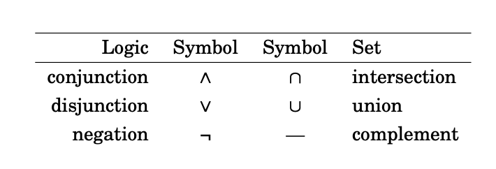
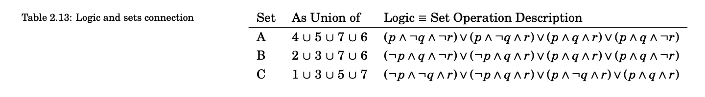
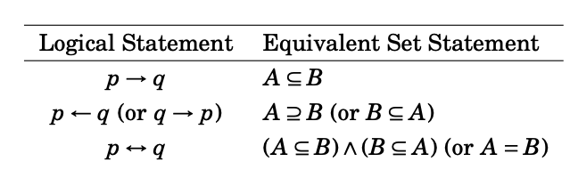
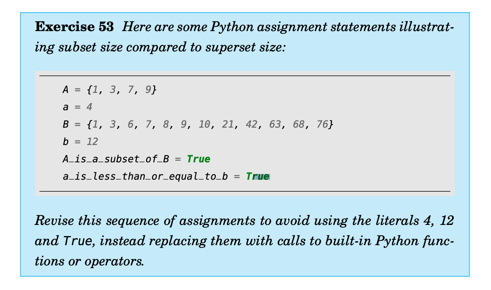

# Sets and Logic

[Go Back Home](/readme.md)

## 2.1 Set the Stage


## 2.2 Start with Propositions
A proposition: a sentence that is either true or false, nothing else.

“A proposition about sets: The English Alphabet can be split into the set of vowels and the set of consonants.” 

“A proposition about numbers: The square of a number is always greater than that number. 

The second so-called proposition is false, but 

“But remember, it’s still a proposition even if it’s false.” 

“We are done for today and you are leaving,” said Til. “That’s an example, by the way, of a compound proposition — two standalone propositions (We are done for today, you are leaving) 

Ex.6) Write three propositions and three non-propositions. 
Props 
- A stone is solid 
- Humans breathe 
- Muscle gets bigger by working out and eating well 

Non-Props 
- Humans itself fly 
- Water is solid 
- Air is visible 

Ex.7) Put the proposition “x is a member of the set of English alphabet consonants” in symbolic logic terms, using C as the symbol naming the set of consonants. 
C > x 

Ex.8) Proposition or not? If so, true or false? “2 + 2 = 4.” 
True 

Ex.9) Proposition or not? If so, true or false? “2 + 1 = 4.” 
False 

Ex.10) Proposition? True or false? “Toronto is the capital of Germany.” 
False 

Ex.11) Proposition? True or false? “Read these questions carefully.” 
=> ? I think True 

Ex.12) Proposition? True or false? “x + y + z = q.” 
False because all variables are not sure 

EX.13) Proposition? True or false? “What time is it?” 
True 

Ex. 14) Proposition? True or false? “2x + 3 = 9.” 
False 

Ex.15) Proposition? True or false? “Jump!” 
True

Ex.16) “Weeks are shorter than months.” Is this a simple proposition or a compound proposition 
Simple 

Ex.17) Simple or compound? “Days are longer than hours and minutes.” 
Compound 

Ex.18) Simple or compound? “Hours are longer than minutes and seconds are shorter than minutes.”  
Compound 

Ex.19)  Simple or compound? “People can fly or pigs can sing.” 
Compound 

## 2.3 Modeling Stuff

#### use of p and q
p = “snow is white”
q = “grass is white”
“Now, the compound proposition p and not q represents our interpretation of this world.”
“So, roughly speaking, a model is what meanings or interpretations
we give to symbols. In general, models are all over the map, but in propositional logic, models are assignments of truth values to propositions,
which, for convenience, we will continue to use variables for.”
^^ Abu almost spoke his little joke: I used
to think I was indecisive, but now I’m not so sure! —


For now just focus on **not** — not is not 
a connective in the sense of connecting two propositions together

But in symbolic logic, you can be lazy and succinct! Prefix any proposition p with ¬ to get **¬ p**, and you just **inverted** its truth sense, no muss no fuss.”

Ex.20) Express in English (“anglify”) the negation of “Two plus two is four.”
“Two plus two is not four.”

Ex.21) Anglify the negation of “Two plus two equals four."
“Two plus two doesn'T equal four. 

Ex.22) Negate/anglify “Toronto is the capital of Germany."
“Toronto is not the capital of Germany.”

Ex.23) Negate/anglify “A total eclipse happens infrequently.”
“A total eclipse doesn't happen infrequently.”

Ex.24) Negate/anglify “Special measures must be taken to deal with the current situation.”
“Special measures must not be taken to deal with the current situation.”

Ex.25) Let p be the proposition “I studied.” and q be the proposition “I got an A on the test.” Anglify p ∧ q.
“I studied and I got an A on the test.”

Ex.26) Anglify ¬p ∧ q.
"I didn't study and I got an A on the test."

Ex.27) Anglify p ∧ ¬q
"I studied and I didn't get an A on the test."

Ex.28) Anglify ¬p ∧ ¬q
"I didn't study and I didn't get an A on the test."

Ex.29) Anglify p ∨ q. 
"I studied or I got an A on the test."

Ex.30) Anglify ¬p ∨ q
"I didn't study or I got an A on the test."

Ex.31) Anglify p ∨ ¬q
"I studied or I didn't get an A on the test."

Ex.32) Anglify ¬p ∨ ¬q
"I didn't study or I didn't get an A on the test."

## 2.4 Exclusive and Inclusive
Inclusive: “p or q” is true if either p is true or q is true, or both. **"include or"**
Exclusive: “p xor q” is true if either p is true or q is true, but not both.” **"exclude or"**

Ex.33) Which or? “A side of fries or chips comes with your sandwich.”
Exclusive or because not both

Ex.34) Which or? “A high school diploma or a GED are needed for this position.”
Inclusive or because both are fine 

Ex.35) Which or? “To get your license, you must provide your social security card or birth certificate.”
Inclusive or because both are fine

Ex.36) Which or? “You can cash in your tickets or exchange them for a prize.”
Exclusive or because not both
x Inclusive

## 2.5 Rules to Build By
“Never settle for the superficial! — Always look below the surface!”

Think of these rules as a recipe for making propositional molecules from propositional atoms.
There are four of them:”
1. A proposition is a variable, that is, a single element from the set
{p, q, r, s,t,...};
2. alternatively, a proposition is a proposition preceded by a not;
3. alternatively, a proposition is a proposition followed by a connective followed by a proposition.
4. A connective is a single element from the set {and, or, xor}


“Now note that this is ambiguous. Does it mean p and, say s where s
is q or not r? Or does it mean s or not r where s is p and q? In other
words, which is the right interpretation, p and (q or not r), which is
called associating from the right, or (p and q) or not r, which is associating from the left.

The parentheses are the extra syntactic sugar we need to sprinkle 
on the expression to disambiguate its meaning— force the choice of 
associating from the right or associating from the left.”

## 2.6 Truth Tables

A truth table is just a tabulation of possible models. 

| p     | q     | r     | not r  | (q or not r) | p and (q or not r) |
| ----- | ----- | ----- | ------ | ------------ | ------------------ |
| false | false | false | true   | true         | false              | 
| false | false | true  | false  | false        | false              | 
| false | true  | false | true   | true         | false              | 
| false | true  | true  | false  | true         | false              | 
| true  | false | false | true   | true         | true               | 
| true  | false | true  | false  | false        | false              | 
| true  | true  | false | true   | true         | true               | 
| true  | true  | true  | false  | true         | true               | 

If you wanna save space, 
- false => F, 0
- true  => T, 1

and becomes ∧, or becomes ∨, and not becomes ¬


Ex.39) Compare the truth table outputs in Table 2.5 with those
in Table 2.6.
Some lines are the same

Ex.40) Construct a truth table for p ∧ p.
∨, and not becomes ¬
| p | ∧ | p |
|---|---|---|
| 0 | 0 | 0 |
| 0 | 0 | 1 |
| 1 | 0 | 0 |
| 1 | 1 | 1 |

Ex.41) Construct a truth table for p ∨ p.
| p | ∨ | p |
|---|---|---|
| 0 | 0 | 0 |
| 0 | 1 | 1 |
| 1 | 1 | 0 |
| 1 | 1 | 1 |

Ex.42) Construct a truth table for ¬p ∨ q.
| ¬ | p | ∨ | p |
|---|---|---|---|
| 1 | 0 | 1 | 0 |
| 1 | 0 | 1 | 1 |
| 0 | 1 | 0 | 0 |
| 0 | 1 | 1 | 1 |

Ex.43) Construct a truth table for p ∧ ¬q.
| p | ∧ | ¬ | p |
|---|---|---|---|
| 0 | 0 | 1 | 0 |
| 0 | 0 | 0 | 1 |
| 1 | 1 | 1 | 0 |
| 1 | 0 | 0 | 1 |

Ex.44) Construct a truth table for the proposition p∧(q⊕¬r).
| p | ∧ | (q | ⊕ | ¬ | r) |
|---|---|----|---|---|----|
| 0 | 0 | 0  | 1 | 1 | 0  |
| 0 | 0 | 0  | 0 | 0 | 1  |
| 0 | 0 | 1  | 0 | 1 | 0  |
| 0 | 0 | 1  | 1 | 0 | 1  |
| 1 | 1 | 0  | 1 | 1 | 0  |
| 1 | 0 | 0  | 0 | 0 | 1  |
| 1 | 0 | 1  | 0 | 1 | 0  |
| 1 | 1 | 1  | 1 | 0 | 1  |

Ex.45) Construct a truth table for the proposition p∨(¬q⊕¬r).
| p | ∨ | (¬ | q | ⊕ | ¬ | r) |
|---|---|----|---|---|---|----|
| 0 | 0 | 1  | 0 | 0 | 1 | 0  |
| 0 | 1 | 1  | 0 | 1 | 0 | 1  |
| 0 | 1 | 0  | 1 | 1 | 1 | 0  |
| 0 | 0 | 0  | 1 | 0 | 0 | 1  |
| 1 | 1 | 1  | 0 | 0 | 1 | 0  |
| 1 | 1 | 1  | 0 | 1 | 0 | 1  |
| 1 | 1 | 0  | 1 | 1 | 1 | 0  |
| 1 | 1 | 1  | 1 | 0 | 1 | 1  |

Ex.46) Construct a truth table for the proposition (p ∨ ¬q) ⊕
(¬r ∧ ¬s).
| (p | ∨ | ¬ | q) | ⊕ | (¬ | r | ∧ | ¬ | s) | 01   |
|----|---|---|----|---|----|---|---|---|----|------|
| 0  | 1 | 1 | 0  | 0 | 1  | 0 | 1 | 1 | 0  | 0000 |
| 0  | 1 | 1 | 0  | 1 | 1  | 0 | 0 | 0 | 1  | 0001 |
| 0  | 1 | 1 | 0  | 1 | 0  | 1 | 0 | 1 | 0  | 0010 |
| 0  | 0 | 0 | 1  | 1 | 1  | 0 | 1 | 1 | 0  | 0100 |
| 0  | 1 | 1 | 0  | 1 | 0  | 1 | 0 | 0 | 1  | 0011 |
| 0  | 0 | 0 | 1  | 0 | 1  | 0 | 0 | 0 | 1  | 0101 |
| 0  | 0 | 0 | 1  | 0 | 0  | 1 | 0 | 1 | 0  | 0110 |
| 0  | 0 | 0 | 1  | 0 | 0  | 1 | 0 | 0 | 1  | 0111 |
| 1  | 1 | 1 | 0  | 0 | 1  | 0 | 1 | 1 | 0  | 1000 |
| 1  | 1 | 1 | 0  | 1 | 1  | 0 | 0 | 0 | 1  | 1001 |
| 1  | 1 | 1 | 0  | 1 | 0  | 1 | 0 | 1 | 0  | 1010 |
| 1  | 1 | 0 | 1  | 0 | 1  | 0 | 1 | 1 | 0  | 1100 |
| 1  | 1 | 1 | 0  | 1 | 0  | 1 | 0 | 0 | 1  | 1011 |
| 1  | 1 | 0 | 1  | 1 | 1  | 0 | 0 | 0 | 1  | 1101 |
| 1  | 1 | 0 | 1  | 1 | 0  | 1 | 0 | 1 | 0  | 1110 |
| 1  | 1 | 0 | 1  | 1 | 0  | 1 | 0 | 0 | 1  | 1111 |

## 2.7 Go Visual 

two sets A and B are disjoint if A intersect B is empty. And if you have more than two sets, they are called pairwise (or mutually) disjoint if no two of them have a non-empty intersection. In other words, pick any two of many sets, the intersection of the pair of them is always empty. For example, in Figure 2.6, A, B, and C are **mutually disjoint**.”


Ex.47) Which pairs of the following sets are disjoint?
1. The set of all even numbers.
2. The set of all odd numbers.
3. The set of all nonnegative powers of 2.
1-2, 2-3

Ex.48) Which pairs of the following sets are disjoint?
1. The set of all white elephants.
2. The set of all gray pachyderms.
3. The set of all purple cows.
1-3, 2-3

If A and B are sets, then:
- The **union** of A and B, denoted A ∪ B, is the set with members from A or B or both.
- The **intersection** of A and B, denoted A ∩ B, is the set with members in common with A and B.
- The **difference** of A and B, denoted A \ B, is the set with members from A but not B.
- The **complement** of B, denoted B, is the set with members not in B.”


Ex.49) What is the correlation between the first three columns and the last three columns of Table 2.9?
They all exclude elements in blue which also ara in red and yellow. 

Ex.50) What is the set difference between the set of letters in the English alphabet and the set of letters in the Hawaiian alphabet?
Hawaiian alphabet doesn't include all letters of the English alphabet.

## 2.8 Propositional Membership
But first, let’s make explicit the connection between logical and set operations.” (See Table 2.11.)




Ex.51) Explain the connection between logic and sets in Table 2.13 where
- p is the proposition ‘x ∈ A’;
- q is ‘x ∈ B’; and
- r = ‘x ∈ C’.
I don't know what to say, but I understood the table. 

Ex.52) Let
- set A = {’verve’, ’vim’, ’vigor’}, and
- set B = {’butter’, ’vinegar’, ’pepper’, ’vigor’}.
For each of the following set operations, give its resulting members as a set of strings:
1. The set of words that are in A ∪ B; call this set C.
C = {’verve’, ’vim’, ’vigor’, ’butter’, ’vinegar’, ’pepper’, ’vigor’}
2. The set of words that are in A ∩ B; call this set D.
D = {’vigor’}
3. The subset of set C of words that start with ‘v’.
sub_C = {’verve’, ’vim’, ’vigor’, ’vinegar’, ’vigor’}
4. The subset of set C of words that end with ‘r’.
sub_R = {’vigor’, ’butter’, ’vinegar’, ’pepper’, ’vigor’}
5. The subset of set C of words that start with ‘v’ and end with ‘r’.
sub_VR = {'vinegar', ’vigor’}
6. The subset of set D of words that have six letters.
sub_D = {'butter', 'vinegar'}

## 2.9 Conditional Containment

- “B is a subset of A (B ⊆ A) means that if x ∈ B then x ∈ A.”
- “A is a superset of B (A ⊇ B) means that B is a subset of A.”
- “B is a proper subset of A (B ⊂ A) means that there is some element
of A that is not in B. In other words, A is strictly speaking ‘bigger’
than B.”
- “A is a proper superset of B (A ⊃ B) means that B is a proper subset of A.”




```python 
a = len(A)
b = len(B)
a_is_less_than_or_equal_to_b = b - a >= 0
```

Ex.54) The Venn diagram in Figure 2.13 shows three numbered regions of Universal set U and set B with a superset-subset-of relationship with set A. Make a connection between the logical conditional operator (→) and the definition of a subset. Refer to the three numbered regions in your answer.
2 -> 3

Exercise 55 
Let p be the proposition “I studied.” and let q be the proposition “I got an A on the test.” Express the proposition p → q as an English sentence (“anglify”).
I studied only if I got an A on the test. x
A. If I studied, then I got an A on the test

Exercise 56 
Anglify ¬p ∨ ¬q.
If I didn't study, then I didn't get an A on the test. 

Exercise 57 
Anglify ¬p → (p ∨ q)
If I didn't study, then I studied or I got an A on the test

Exercise 58 
Anglify ¬p → ¬q.
If I didn't study, then I didn't study. 

Exercise 59 
Let p be the proposition “You applied for admission at BYU-Idaho.” and let q be the proposition “You were accepted.” Express “You applied for admission at BYU-Idaho and were accepted.” as a symbolic compound proposition using logical connectives (“symbolize”).
p ∧ q

Exercise 60 
Symbolize “You did not apply for admission at BYUIdaho but were still accepted.”
¬p ∧ q

Exercise 61 
Symbolize “You applied for admission at BYU-Idaho but were not accepted.”
p ∧ ¬q

Exercise 62 
Symbolize “Either you did not apply for admission at BYU-Idaho and didn’t get accepted or you did apply and got accepted.”
(¬p ∧ ¬q) ∨ (p ∧ q)

Exercise 63 There are many different ways in English to put the
same conditional statement, ‘if p then q’. Here are four:
1. p → q (pronounced) p only if q.
2. omit the ‘then’: if p, q.
3. reversed: q if p.
4. ‘whenever’ means ‘if’: whenever p, q (or q whenever p).
Find at least four other ways.
1. p is sufficient for q.
2. p is a sufficient condition for q.
3. p implies q.
4. q is implied by p.
Exercise 64 
Symbolize “Your applying for admission at BYU-Idaho is necessary for your being accepted.”
p → q ?

Exercise 65 Symbolize “Your being accepted is a sufficient condition for your applying for admission at BYU-Idaho.”
q → p

Exercise 66 
Symbolize “Your applying for admission at BYU-Idaho is necessary and sufficient for your being accepted.”
p ←→ q

## 2.10 Understanding Conditional Logic

“That’s what I’m talking about, what does ‘more true than’ mean? Something is either true or it’s not. How can it be ‘more true’? Truer than true?!” “Well, here’s how I see it,” said Abu. “When they have the same truth value, both true or both false, neither is more or less than the other, they’re equal.” Ila blushed. “Oh — now I get it. A true p is greater than a false q. And the last case, when p is false and q is true, p is less true than q. Way less, because it has zero truth.”

Exercise 67 
True or false? “If 2 + 2 = 4, then pigs can fly.”
False

Exercise 68 
True or false? “If 2 + 7 = 5, then Elvis Presley is still alive.”
False

Exercise 69 
True or false? “If pigs can fly, then dogs can’t fly.”
True ? 

Exercise 70 
True or false? “If dogs have four legs, then ostriches have two legs.”
true

Exercise 72 
True or false? “1 + 2 = 3 if and only if 3 + 1 = 6.”
False

Exercise 73 
True or false? “1 + 3 = 2 if and only if the earth is flat.”
True

Exercise 74 
True or false? “1 < 2 if and only if 2 < 3.”
True

Exercise 75 
Write “It is necessary to sign up to win the contest.” as an ‘If p then q’ statement (“symbolize-as-if-then”).
If winning the contest, then singing up.

Exercise 76 
Symbolize-as-if-then “I get a cold whenever I go outside.”
If I go outside, I get a cold. 

Exercise 77 
Symbolize-as-if-then “It is sufficient to be an A student to receive the scholarship.”
If you are an A student then you receive the scholarship

Exercise 78 
Symbolize-as-if-then “As long as you leave now, you will get there on time.”
If you will get there on time, then you leave now.

Exercise 79 
Symbolize-as-if-then “I’ll get half off if I act now.”
If I act now then I’ll get half off

1. q is necessary for p.
2. q is a necessary condition for p.
3. p is sufficient for q.
4. p is a sufficient condition for q.
5. p implies q.
6. q is implied by p.
7. p entails q.
8. q is entailed by p.

## 2.11 Conditional Vocabulary

“Some important terms and notation that you need to know when analyzing conditionals are:”
- Dual
- Antecedent
- Consequent
- Vacuous
- Trivial
- Set-builder notation

**The Duality Principle** says you can interchange duals in a valid Boolean expression and the result is also valid. For example, De Morgan’s laws of negation of conjunctions and disjunctions are duals of each other, because ∧ and ∨ are duals. Also, 0 (false) is the dual of 1 (true), and vice versa, and ¬ is its own dual (self-dual).”

**The antecedent** is what comes before the conditional operator, and **the consequent** is what comes after it. For example, in ‘If sunset heralds night then sunrise heralds day’ the antecedent is ‘sunset heralds night’ and ‘sunrise heralds day’ is the consequent.”

“The terms **vacuously true** and **trivially true** are a little subtle. Since the conditional p → q is true whenever the antecedent p is false, it is called a vacuous (empty, void) truth, because any consequent whatsoever follows from a false antecedent. The dual of a vacuously true conditional is one that is trivially true. This is when the consequent q is true — because whether or not the antecedent is true has no effect on the conditional — it is always (trivially) true.”

The notation, **set-builder notation**, essentially describes the process for building a set by giving a conditional expression that governs membership in a set. 

“Also important to know are the three variants of the conditional statement,” Til continued, “known as the **converse**, the **inverse** and the **contrapositive**:
- The straight conditional is p → q (not a variant);
- its converse is q → p (swap antecedent and consequent);
- its inverse is ¬p → ¬q (negate both antecedent and consequent); and,
- its contrapositive is ¬q → ¬p (the inverse of the converse).

Exercise 80 
Write the converse, inverse, and contrapositive of (“variantize”) “If it rains today, we won’t go to the park.” 
Converse: If we don't go to the park, it will rain today.
Inverse: If it doesn't rain today, we will go to the park.
contrapositive: If we go to the park, it will not rain today.

Exercise 81 
Variantize “If you do your homework, I’ll give you a pat
on the back.”
Converse: If I give you a pat on the back, you will do your homework.
Inverse: If you don't do your homework, I’ll not give you a pat
on the back.
contrapositive: If I don't give you a pat on the back, you will not do your homework.

Exercise 82 
Variantize “Whenever I babysit, I get sick.”
Converse: If I get sick, I (will?) babysit.
Inverse: If I don't babysit, I won't get sick.
contrapositive: If I don't get sick, I (won't?) don't babysit.

Exercise 83 
Variantize “Every time there is a quiz, I go to class.”
Converse: Every time I go to class, there is a quiz.
Inverse: Every time there isn't a quiz, I don't go to class.
contrapositive: Every time I don't go to class, there isn't a quiz.

Exercise 84 
Variantize “I wake up late when I stay up past my bedtime.”
Converse: I stay up past my bedtime when I wake up late.
Inverse: I don't wake up late when I don't stay up past my bedtime.
contrapositive: I don't stay up past my bedtime when I don't wake up late.

Exercise 85 
Construct a truth table for p → ¬q.
All true except for the last row when p and q are both
true

## 2.12 Logical Equivalence


- A **tautology** is a proposition that is always true. For example, p∨¬p.
- A **contradiction** is a proposition that is always false. For example,
p ∧ ¬p.
- A **contingency** is a proposition that is neither a tautology nor a contradiction, but is sometimes true, sometimes false. For example,
p → q.”

