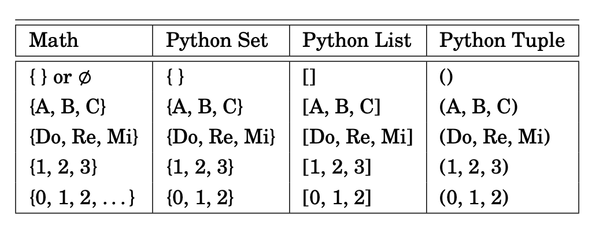
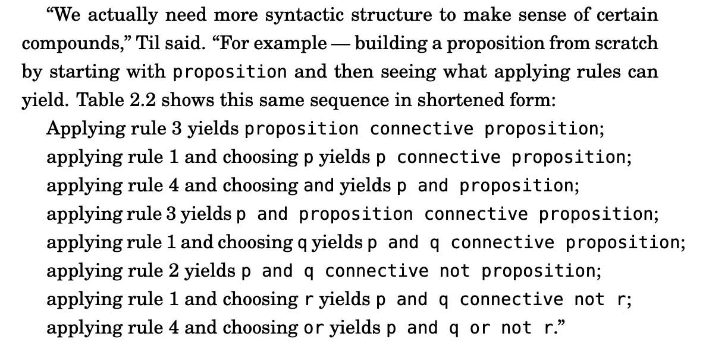
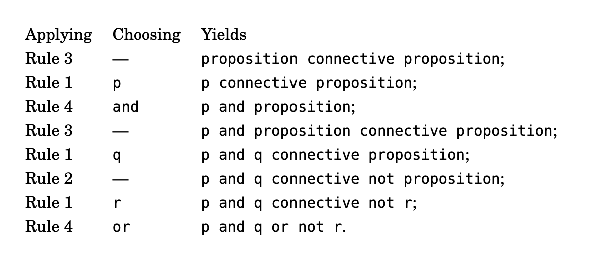
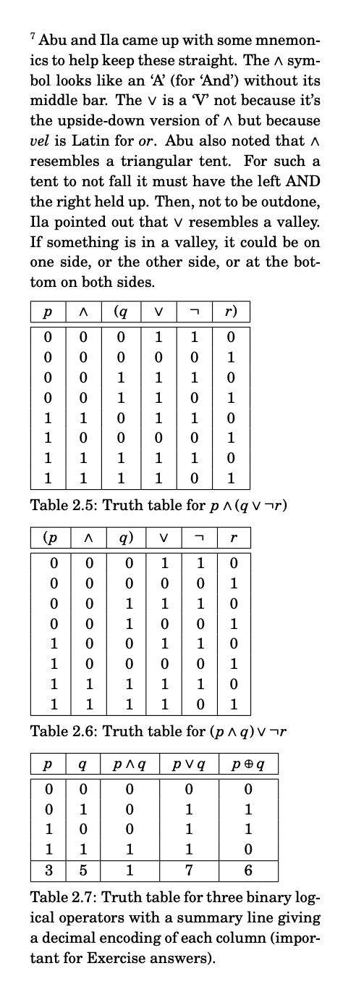
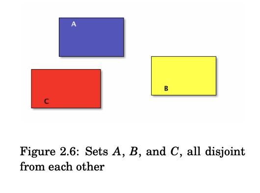
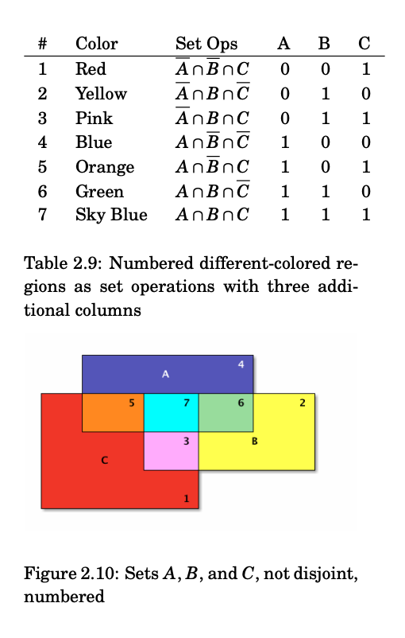

# Sets and Logic

[Go Back Home](/readme.md)

## 2.1 Set the Stage

## 2.2 Start with Propositions
A proposition: a sentence that is either true or false, nothing else.

“A proposition about sets: The English Alphabet can be split into the set of vowels and the set of consonants.” 

“A proposition about numbers: The square of a number is always greater than that number. 

The second so-called proposition is false, but 

“But remember, it’s still a proposition even if it’s false.” 

“We are done for today and you are leaving,” said Til. “That’s an example, by the way, of a compound proposition — two standalone propositions (We are done for today, you are leaving) 

Ex.6) Write three propositions and three non-propositions. 
Props 
- A stone is solid 
- Humans breathe 
- Muscle gets bigger by working out and eating well 

Non-Props 
- Humans itself fly 
- Water is solid 
- Air is visible 

Ex.7) Put the proposition “x is a member of the set of English alphabet consonants” in symbolic logic terms, using C as the symbol naming the set of consonants. 
C > x 

Ex.8) Proposition or not? If so, true or false? “2 + 2 = 4.” 
True 

Ex.9) Proposition or not? If so, true or false? “2 + 1 = 4.” 
False 

Ex.10) Proposition? True or false? “Toronto is the capital of Germany.” 
False 

Ex.11) Proposition? True or false? “Read these questions carefully.” 
=> ? I think True 

Ex.12) Proposition? True or false? “x + y + z = q.” 
False because all variables are not sure 

EX.13) Proposition? True or false? “What time is it?” 
True 

Ex. 14) Proposition? True or false? “2x + 3 = 9.” 
False 

Ex.15) Proposition? True or false? “Jump!” 
True

Ex.16) “Weeks are shorter than months.” Is this a simple proposition or a compound proposition 
Simple 

Ex.17) Simple or compound? “Days are longer than hours and minutes.” 
Compound 

Ex.18) Simple or compound? “Hours are longer than minutes and seconds are shorter than minutes.”  
Compound 

Ex.19)  Simple or compound? “People can fly or pigs can sing.” 
Compound 

## 2.3 Modeling Stuff

#### use of p and q
p = “snow is white”
q = “grass is white”
“Now, the compound proposition p and not q represents our interpretation of this world.”
“So, roughly speaking, a model is what meanings or interpretations
we give to symbols. In general, models are all over the map, but in propositional logic, models are assignments of truth values to propositions,
which, for convenience, we will continue to use variables for.”
^^ Abu almost spoke his little joke: I used
to think I was indecisive, but now I’m not so sure! —

For now just focus on **not** — not is not 
a connective in the sense of connecting two propositions together

But in symbolic logic, you can be lazy and succinct! Prefix any proposition p with ¬ to get **¬ p**, and you just **inverted** its truth sense, no muss no fuss.”

Ex.20) Express in English (“anglify”) the negation of “Two plus two is four.”
“Two plus two is not four.”

Ex.21) Anglify the negation of “Two plus two equals four."
“Two plus two doesn'T equal four. 

Ex.22) Negate/anglify “Toronto is the capital of Germany."
“Toronto is not the capital of Germany.”

Ex.23) Negate/anglify “A total eclipse happens infrequently.”
“A total eclipse doesn't happen infrequently.”

Ex.24) Negate/anglify “Special measures must be taken to deal with the current situation.”
“Special measures must not be taken to deal with the current situation.”

Ex.25) Let p be the proposition “I studied.” and q be the proposition “I got an A on the test.” Anglify p ∧ q.
“I studied and I got an A on the test.”

Ex.26) Anglify ¬p ∧ q.
"I didn't study and I got an A on the test."

Ex.27) Anglify p ∧ ¬q
"I studied and I didn't get an A on the test."

Ex.28) Anglify ¬p ∧ ¬q
"I didn't study and I didn't get an A on the test."

Ex.29) Anglify p ∨ q. 
"I studied or I got an A on the test."

Ex.30) Anglify ¬p ∨ q
"I didn't study or I got an A on the test."

Ex.31) Anglify p ∨ ¬q
"I studied or I didn't get an A on the test."

Ex.32) Anglify ¬p ∨ ¬q
"I didn't study or I didn't get an A on the test."

## 2.4 Exclusive and Inclusive
Inclusive: “p or q” is true if either p is true or q is true, or both. **"include or"**
Exclusive: “p xor q” is true if either p is true or q is true, but not both.” **"exclude or"**

Ex.33) Which or? “A side of fries or chips comes with your sandwich.”
Exclusive or because not both

Ex.34) Which or? “A high school diploma or a GED are needed for this position.”
Inclusive or because both are fine 

Ex.35) Which or? “To get your license, you must provide your social security card or birth certificate.”
Inclusive or because both are fine

Ex.36) Which or? “You can cash in your tickets or exchange them for a prize.”
Exclusive or because not both
x Inclusive

## 2.5 Rules to Build By
“Never settle for the superficial! — Always look below the surface!”

Think of these rules as a recipe for making propositional molecules from propositional atoms.
There are four of them:”
1. A proposition is a variable, that is, a single element from the set
{p, q, r, s,t,...};
2. alternatively, a proposition is a proposition preceded by a not;
3. alternatively, a proposition is a proposition followed by a connective followed by a proposition.
4. A connective is a single element from the set {and, or, xor}

“Now note that this is ambiguous. Does it mean p and, say s where s
is q or not r? Or does it mean s or not r where s is p and q? In other
words, which is the right interpretation, p and (q or not r), which is
called associating from the right, or (p and q) or not r, which is associating from the left.

The parentheses are the extra syntactic sugar we need to sprinkle 
on the expression to disambiguate its meaning— force the choice of 
associating from the right or associating from the left.”

## 2.6 Truth Tables

A truth table is just a tabulation of possible models. 

| p     | q     | r     | not r  | (q or not r) | p and (q or not r) |
| ----- | ----- | ----- | ------ | ------------ | ------------------ |
| false | false | false | true   | true         | false              | 
| false | false | true  | false  | false        | false              | 
| false | true  | false | true   | true         | false              | 
| false | true  | true  | false  | true         | false              | 
| true  | false | false | true   | true         | true               | 
| true  | false | true  | false  | false        | false              | 
| true  | true  | false | true   | true         | true               | 
| true  | true  | true  | false  | true         | true               | 

If you wanna save space, 
- false => F, 0
- true  => T, 1

and becomes ∧, or becomes ∨, and not becomes ¬

Ex.39) Compare the truth table outputs in Table 2.5 with those
in Table 2.6.
Some lines are the same

Ex.40) Construct a truth table for p ∧ p.
∨, and not becomes ¬
| p | ∧ | p |
|---|---|---|
| 0 | 0 | 0 |
| 0 | 0 | 1 |
| 1 | 0 | 0 |
| 1 | 1 | 1 |

Ex.41) Construct a truth table for p ∨ p.
| p | ∨ | p |
|---|---|---|
| 0 | 0 | 0 |
| 0 | 1 | 1 |
| 1 | 1 | 0 |
| 1 | 1 | 1 |

Ex.42) Construct a truth table for ¬p ∨ q.
| ¬ | p | ∨ | p |
|---|---|---|---|
| 1 | 0 | 1 | 0 |
| 1 | 0 | 1 | 1 |
| 0 | 1 | 0 | 0 |
| 0 | 1 | 1 | 1 |

Ex.43) Construct a truth table for p ∧ ¬q.
| p | ∧ | ¬ | p |
|---|---|---|---|
| 0 | 0 | 1 | 0 |
| 0 | 0 | 0 | 1 |
| 1 | 1 | 1 | 0 |
| 1 | 0 | 0 | 1 |

Ex.44) Construct a truth table for the proposition p∧(q⊕¬r).
| p | ∧ | (q | ⊕ | ¬ | r) |
|---|---|----|---|---|----|
| 0 | 0 | 0  | 1 | 1 | 0  |
| 0 | 0 | 0  | 0 | 0 | 1  |
| 0 | 0 | 1  | 0 | 1 | 0  |
| 0 | 0 | 1  | 1 | 0 | 1  |
| 1 | 1 | 0  | 1 | 1 | 0  |
| 1 | 0 | 0  | 0 | 0 | 1  |
| 1 | 0 | 1  | 0 | 1 | 0  |
| 1 | 1 | 1  | 1 | 0 | 1  |

Ex.45) Construct a truth table for the proposition p∨(¬q⊕¬r).
| p | ∨ | (¬ | q | ⊕ | ¬ | r) |
|---|---|----|---|---|---|----|
| 0 | 0 | 1  | 0 | 0 | 1 | 0  |
| 0 | 1 | 1  | 0 | 1 | 0 | 1  |
| 0 | 1 | 0  | 1 | 1 | 1 | 0  |
| 0 | 0 | 0  | 1 | 0 | 0 | 1  |
| 1 | 1 | 1  | 0 | 0 | 1 | 0  |
| 1 | 1 | 1  | 0 | 1 | 0 | 1  |
| 1 | 1 | 0  | 1 | 1 | 1 | 0  |
| 1 | 1 | 1  | 1 | 0 | 1 | 1  |

Ex.46) Construct a truth table for the proposition (p ∨ ¬q) ⊕
(¬r ∧ ¬s).
| (p | ∨ | ¬ | q) | ⊕ | (¬ | r | ∧ | ¬ | s) | 01   |
|----|---|---|----|---|----|---|---|---|----|------|
| 0  | 1 | 1 | 0  | 0 | 1  | 0 | 1 | 1 | 0  | 0000 |
| 0  | 1 | 1 | 0  | 1 | 1  | 0 | 0 | 0 | 1  | 0001 |
| 0  | 1 | 1 | 0  | 1 | 0  | 1 | 0 | 1 | 0  | 0010 |
| 0  | 0 | 0 | 1  | 1 | 1  | 0 | 1 | 1 | 0  | 0100 |
| 0  | 1 | 1 | 0  | 1 | 0  | 1 | 0 | 0 | 1  | 0011 |
| 0  | 0 | 0 | 1  | 0 | 1  | 0 | 0 | 0 | 1  | 0101 |
| 0  | 0 | 0 | 1  | 0 | 0  | 1 | 0 | 1 | 0  | 0110 |
| 0  | 0 | 0 | 1  | 0 | 0  | 1 | 0 | 0 | 1  | 0111 |
| 1  | 1 | 1 | 0  | 0 | 1  | 0 | 1 | 1 | 0  | 1000 |
| 1  | 1 | 1 | 0  | 1 | 1  | 0 | 0 | 0 | 1  | 1001 |
| 1  | 1 | 1 | 0  | 1 | 0  | 1 | 0 | 1 | 0  | 1010 |
| 1  | 1 | 0 | 1  | 0 | 1  | 0 | 1 | 1 | 0  | 1100 |
| 1  | 1 | 1 | 0  | 1 | 0  | 1 | 0 | 0 | 1  | 1011 |
| 1  | 1 | 0 | 1  | 1 | 1  | 0 | 0 | 0 | 1  | 1101 |
| 1  | 1 | 0 | 1  | 1 | 0  | 1 | 0 | 1 | 0  | 1110 |
| 1  | 1 | 0 | 1  | 1 | 0  | 1 | 0 | 0 | 1  | 1111 |

## 2.7 Go Visual 

two sets A and B are disjoint if A intersect B is empty. And if you have more than two sets, they are called pairwise (or mutually) disjoint if no two of them have a non-empty intersection. In other words, pick any two of many sets, the intersection of the pair of them is always empty. For example, in Figure 2.6, A, B, and C are **mutually disjoint**.”

Ex.47) Which pairs of the following sets are disjoint?
1. The set of all even numbers.
2. The set of all odd numbers.
3. The set of all nonnegative powers of 2.
1-2, 2-3

Ex.48) Which pairs of the following sets are disjoint?
1. The set of all white elephants.
2. The set of all gray pachyderms.
3. The set of all purple cows.
1-3, 2-3

If A and B are sets, then:
- The **union** of A and B, denoted A ∪ B, is the set with members from A or B or both.
- The **intersection** of A and B, denoted A ∩ B, is the set with members in common with A and B.
- The **difference** of A and B, denoted A \ B, is the set with members from A but not B.
- The **complement** of B, denoted B, is the set with members not in B.”

Ex.49) What is the correlation between the first three columns and the last three columns of Table 2.9?
They all exclude elements in blue which also ara in red and yellow. 

Ex.50) What is the set difference between the set of letters in the English alphabet and the set of letters in the Hawaiian alphabet?
Hawaiian alphabet doesn't include all letters of the English alphabet.

## 2.8 Propositional Membership

